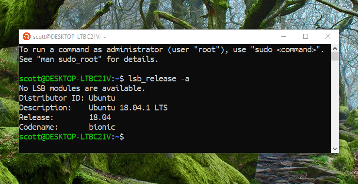
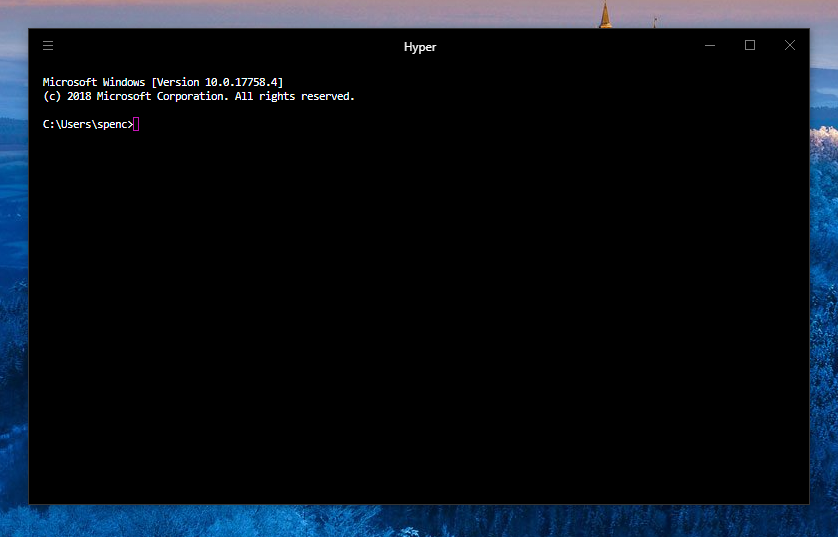

## From scratch to Create React App on Windows

**An opinionated guide on setting up a web development environment on
Windows 10**

I have been a professional web developer for 10 months now and used
both MacOs and Windows in that time. My preferred OS to use is
Windows, for no other reason than I prefer they keyboard layout.

With Windows/Linux I like to have my Ctrl key as the key to use for
copy paste operations and I can use my left pinky instead of my thumb.
Anyway, let's leave the weak reasoning behind as that's not the
purpose of this post!

Let's see what Ken has to say about it:
https://twitter.com/ken_wheeler/status/1075556283795824640

This is the refresh on [my guide from the start of the year] on
setting up a web development environment on a Windows machine.

This guide will cover installing Ubuntu but you can use some of the
other flavours of Linux available in the Windows store, the Debian
setup will be very similar to the Ubuntu one.

## Objective of this post

To go from a fresh instance of Windows 10 to something you can develop
web apps with.

These instructions are for the **Windows 10 Fall Creators Update and
later.**

What we're going to cover:

<!-- TOC -->

- [From scratch to Create React App on Windows](#from-scratch-to-create-react-app-on-windows)
- [Objective of this post](#objective-of-this-post)
- [Install WSL](#install-wsl)
- [Enable WSL on your machine](#enable-wsl-on-your-machine)
- [update, upgrade and autoremove](#update-upgrade-and-autoremove)
- [Install Node (with `n`)](#install-node-with-n)
- [Install Visual Studio Code](#install-visual-studio-code)
- [Install a Terminal (Hyper)](#install-a-terminal-hyper)
- [Install Fish Shell!](#install-fish-shell)
- [Configure](#configure)
  - [Permissions](#permissions)
  - [Use SSH with GitHub](#use-ssh-with-github)
  - [Install Oh My Fish](#install-oh-my-fish)
    - [Fish themes with OMF](#fish-themes-with-omf)
- [Create React App](#create-react-app)
- [Change WSL version](#change-wsl-version)
- [VSCode](#vscode)

<!-- /TOC -->

## Install WSL

You can install Ubuntu from [the Microsoft store] which will be the
first half of the install the second will be when ypu open the app.

## Enable WSL on your machine

The [official guidance] covers it very well, but I'm going to add in
the shortcut keys here if you don't want to be clicking around with
the mouse.

Before that however, if you haven't selected PowerShell as your
default Command Prompt you can select it from the Taskbar settings
page located in the Personalisation section in the Settings, I suggest
doing that now:


Use Windows key+x, this is the same as right clicking the windows icon
on the desktop, this will open the quick link menu. From here you need
to select the Windows PowerShell (<u>A</u>dmin) option, you can do
this by pressing **a** on the keyboard. So Windows key+x then a, will
open the user account control (Admin) prompt, presuming you have admin
rights on your machine you'll need to click yes to continue.

Copy the code here and paste it into the PowerShell window, Ctrl+v
will work in PowerShell, press enter to execute the command.

```bash
Enable-WindowsOptionalFeature -Online -FeatureName Microsoft-Windows-Subsystem-Linux
```

You will be prompted to restart your machine after this, which you
should do.

> Check the link for a complete list of [windows keyboard shortcuts].

After restarting you can open the Ubuntu program from the start menu
and the second install (of WSL on your system) should happen. Wait for
this to complete then you will be prompted to create a user and a
password for the account. You will need to remember the password
created for the user as you will be prompted for it to use `sudo`
privileges.

## update, upgrade and autoremove

At the time of writing this, the version I have linked of Ubuntu is
18.04.1

The linked app will install the latest stable Ubuntu release on
Windows.

You can check what version of Ubuntu you have installed with:

```bash
lsb_release -a
```



If you want to use a specific LTS version of Ubuntu you can get them
from the Windows Store, here:

- [Ubuntu 16.04 LTS]
- [Ubuntu 18.04 LTS]

Now we're going to go ahead an update and upgrade all the things, the
three commands here will update and upgrade all the pre-installed
software that comes with the Ubuntu install.

The code below is three commands joined together with `&&`. The `-y`
flag is to auto accept the changes that are going to be preformed with
the upgrades. Auto remove will remove unused packages left behind from
upgrades.

Copy the below commands into your Ubuntu terminal, and run the
command:

```bash
sudo apt update && sudo apt -y upgrade && sudo apt autoremove
```

> To go from 16.04 to 18.04 try `do-release-upgrade` in the terminal.

Now that the base has been installed and updated we need to install
the [build-essential] package in order to compile and build other
packages, the following packages we're going to install will all need
it.

```bash
sudo apt install -y build-essential
```

From her on in I'd suggest using two bash windows, one with sudo
enabled the other with standard permissions.

> i.e. open a terminal and don't enter `sudo` in there, instead use
> the terminal that has been granted that permission.

The reason for this is that I have found if you install node as sudo
then each time you want to run an `npm install` command you will need
to grant sudo permissions and it can all get a bit tedious. And you
really shouldn't be installing npm packages with sudo permissions.

## Install Node (with `n`)

Let's get our run-time on! If you use Node.js you will eventually have
situations where you need to be able to switch Node versions, for this
you may have heard to nvm ([Node Version Manager]) which by the way
you can still use in WSL.

The reason for me opting for n over nvm is that in the past I
experienced slow bash startup times whilst using nvm. Take a look at
this [WSL GitHub issue detailing it] and the specific comment for the
[pros of using n].

Ok let's install n, with [n-install], the command doesn't start with
sudo so use it in the bash window you have with no sudo privileges.🧐

```bash
curl -L https://git.io/n-install | bash
```

This will install the latest version of Node for us, follow the prompt
on the terminal screen to reload bash:

```bash
# mine looks like this
. /home/scott/.bashrc
```

Now check the versions of Node and npm we have installed with
`node -v && npm -v` in the terminal.

## Install Visual Studio Code

Install VSCode? What? This post is to set up WSL? Ok, so we're going
to presume that this is going from nothing to being able to web dev,
so we're going to need a text editor, and there's nothing out there at
the moment that comes close to VSCode, if you already have a text
editor installed then skip to the next part.

Install the Windows version of VSCode from the [Download section] once
installed we can enable WSL in the settings, the quickest way to do
this is to open the integrated terminal in VSCode with the shortcut
keys Ctrl+' 👈 that's and apostrophe. You will be prompted to select
your default terminal, select WSL Bash.


## Install a Terminal (Hyper)

Now we have bash on Windows it's time to install a nice Terminal app,
because, let's face it, the standard one is a bit basic.

Enter [Hyper] an electron app terminal that is super themeable and
configurable.

Download and install hyper for Windows, this will be the bare bones
version, it'll look something like this:



You may notice that, this is the Windows Command prompt too, don't
worry, we're going to configure that right now.

Open up the `.hyper.js` file located in the root of your user folder,
or from Hyper itself use the sortcut key Ctrl+, to pop open the
settings.

```js
// amend shell path
// WSL Bash
shell: 'C:\\Windows\\System32\\bash.exe',
```

## Install Fish Shell!

## Configure

### Permissions

### Use SSH with GitHub

### Install Oh My Fish

#### Fish themes with OMF

## Create React App

## Change WSL version

## VSCode

Initial update:

```sh
sudo apt update && sudo apt -y upgrade && sudo apt autoremove && sudo apt dist-upgrade
```

Didn't take long at all

fish install was latest version

still need `sudo apt install -y build-essential` for make

must say installing and updating dependencies seems really fast

used n to install node

pretty straightforward and fast

antil malware executable needed exclusions added again

Specifically for using gatsby I was getting
`Error: pngquant failed to build, make sure that libpng-dev is installed`
errors so:

```sh
sudo apt install -y libpng-dev
# npm install -g pngquant-bin
```

Seemed to resolve the issue

<!-- LINKS -->

[the microsoft store]:
  https://www.microsoft.com/en-gb/p/ubuntu/9nblggh4msv6?activetab=pivot:overviewtab
[ubuntu 16.04 lts]:
  https://www.microsoft.com/en-gb/p/ubuntu-1604-lts/9pjn388hp8c9?activetab=pivot:overviewtab
[ubuntu 18.04 lts]:
  https://www.microsoft.com/en-gb/p/ubuntu-1804-lts/9n9tngvndl3q?activetab=pivot:overviewtab
[my guide from the start of the year]:
  https://blog.scottspence.me/wsl-setup/
[official guidance]:
  https://docs.microsoft.com/en-us/windows/wsl/install-win10
[windows keyboard shortcuts]:
  https://support.microsoft.com/en-gb/help/12445/windows-keyboard-shortcuts
[build-essential]: https://packages.ubuntu.com/bionic/build-essential
[node version manager]: https://github.com/creationix/nvm
[wsl github issue detailing it]:
  https://github.com/Microsoft/WSL/issues/776
[pros of using n]:
  https://github.com/Microsoft/WSL/issues/776#issuecomment-266112578
[n-install]: https://github.com/mklement0/n-install
[hyper]: http://hyper.is
