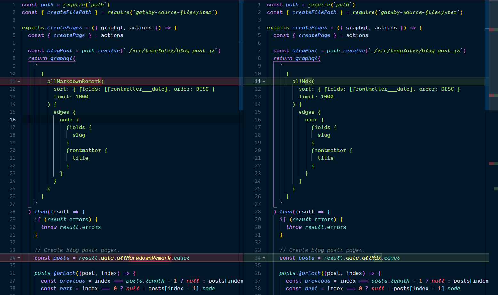
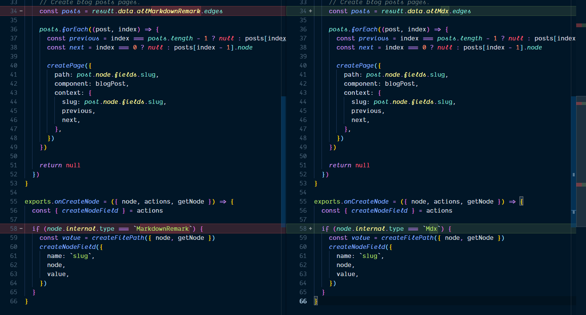
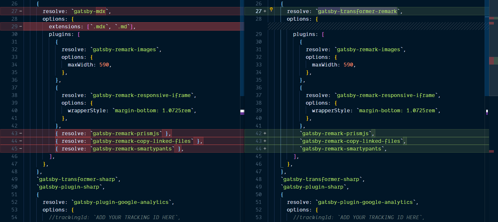
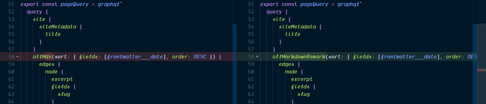
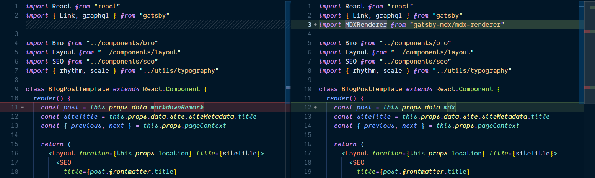
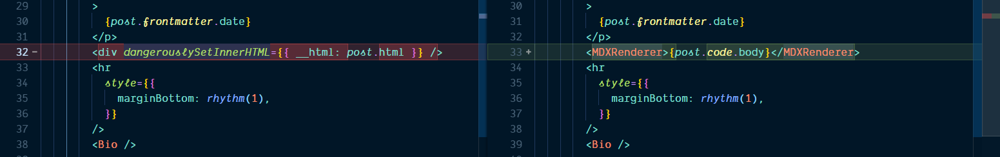
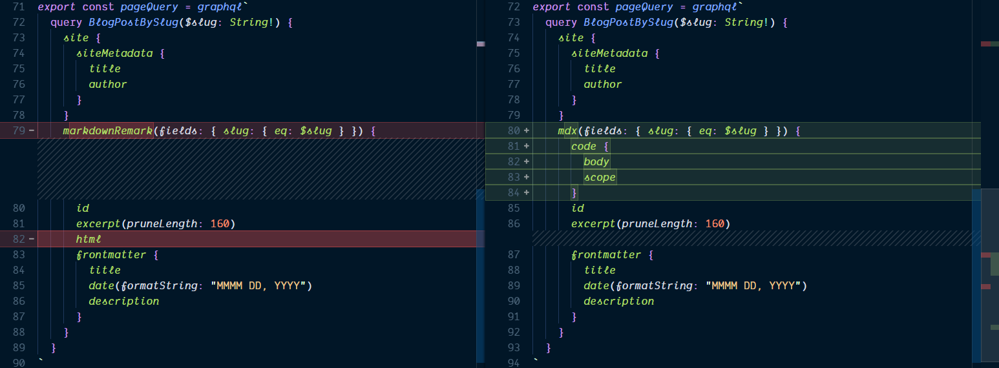

In this guide we're going to cover converting the Gatbsy default blog
starter to use MDX.

All the cool kids are using Gatsby and MDX in their blogs these days.
If you already have a blog that uses Gatsby but want to move onto the
new hotness then this is the guide for you.

https://www.youtube.com/watch?v=gck4RjaX5D4

## Versions:

**This guide is being used with the following dependency versions.**

- gatsby: 2.3.5
- react: 16.8.6
- react-dom: 16.8.6
- gatsby-mdx: 0.4.5
- @mdx-js/mdx: 0.20.3
- @mdx-js/tag: 0.20.3

You can also check out the [example code].

---

We're going to need some links, which are:

- [CodeSandbox docs for importing projects]

- [CodeSandbox import wizard]

- [Gatsby starter blog]

## Import to CodeSandbox

For this example I'm going to be using the [Gatsby starter blog] and
importing it into CodeSandbox, looking at the docs it says you can do
this with the [CodeSandbox import wizard] linked, paste the link in
there and CodeSandbox will open the representation of the code on
GitHub.

Now we can go about moving from using Gatsby transformer remark over
to MDX.

Let's take a look at what we'll be changing for this example. But
first we're going to need to import some dependencies to get MDX
running in out Gatsby project.

With the add dependency button in CodeSandbox add the following
dependencies:

- `gatsby-mdx`
- `@mdx-js/mdx`
- `@mdx-js/tag`

We will also need to add dependencies for styled-components so may as
well add them now as well:

- `gatsby-plugin-styled-components`
- `styled-components`
- `babel-plugin-styled-components`

Files to change:

- `gatsby-node.js`
- `gatsby-config.js`
- `index.js`
- `blog-post.js`

## `gatsby-node.js`

First up we're going to need to change `gatsby-node.js` this is where
all the pages and data nodes are generated.

Change all markdown remark occurrences with MDX, that's the initial
GraphQL query in create pages, then again in the result.



Then change the `node.internal.type` in `onCreateNode` from
`MarkdownRemark` to `Mdx`.



## `gatsby-config.js`

Here we're going to replace `gatsby-transformer-remark` with
`gatsby-mdx`



## `index.js`

Here we're going to alter the `posts` variable to take the `Mdx`
edges.


The `Mdx` edges are taken from the page query, which is also altered
to use `allMdx` in place of `allMarkdownRemark`.



## `blog-post.js`

Now last on the list to get MDX working is the blog post template,
we're going to need to import `MDXRenderer` from `gatsby-mdx` we're
going to replace `dangerouslySetInnerHTML` with this shortly.



Here's where we use it, we'll come onto `post.code.body`.



Again in the query we're replacing `markdownRemark` with `mdx` and
this time also doing away with `html` from the query and adding in
`code` for `body` which we're using in our render method.



## Now we're using MDX!

So now we can create a `.mdx` post, let's do that.

```mdx
---
title: My First MDX Post!
date: '2019-04-07T23:46:37.121Z'
---

import { Butt } from '../../../src/components/button'

# make a site they said, it'll be fun they said

more content yo!

<Butt>yoyoyo</Butt>
```

<!-- Links -->

[example code]: https://codesandbox.io/s/4xqvvwy6x4
[gatsby starter blog]: https://github.com/gatsbyjs/gatsby-starter-blog
[codesandbox import wizard]: https://codesandbox.io/s/github
[codesandbox docs for importing projects]:
  https://codesandbox.io/docs/importing
